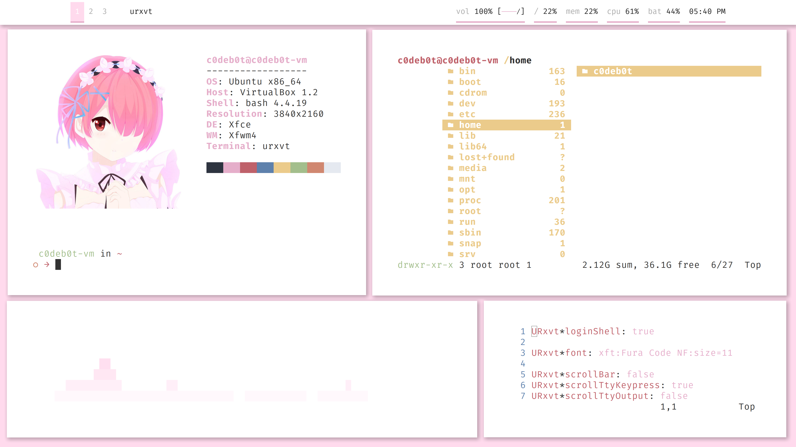

# White and Pink
My white and light pink setup. Note that I did not include keybindings and XFCE/XFWM specific files.

## My keybindings
- Ctrl-Alt-h left workspace
- Ctrl-Alt-l right workspace
- Ctrl-Alt-t launch terminal (Urxvt)
- Ctrl-Alt-w launch Firefox
- Ctrl-Alt-f launch Ranger in Urxvt
- Ctrl-Alt-r launch Rofi

- Alt-F1 resize window
- Alt-F2 minimize window
- Alt-F3 maximize window
- Alt-F4 close window

## Other information
- Ranger uses devicons for the icons
- NoButton XFCE theme is used, but the border is scaled up through ImageMagick
- Font used is Fira Code (patched Fira Code, or Fura Code, for Urxvt)
- Rofi uses a modified version of the Rofi OneDark theme
- Urxvt uses a modified version of the Nord theme
- Polybar is just modified from the example
- Papirus icons are used
- The GTK theme is Qogir light, but modified to have a light pink highlight
- The OS is Xubuntu
- I picked Ram because she matches the color scheme for W3m in Neofetch
